# Руководство пользователя WriterWorldBuilder

*Данное руководство находится в разработке.*

[Вернуться на главную страницу проекта](../README.md)

## 1. Введение

WriterWorldBuilder — это настольное приложение, разработанное специально для писателей, чтобы помочь им создавать, организовывать и управлять вымышленными мирами и повествованиями своих историй. Приложение позволяет строить сложные взаимосвязи между персонажами, локациями, предметами и событиями, обеспечивая целостность и логичность вашего мира.

**Основные возможности:**

* **Управление проектами:** Создавайте, открывайте и легко управляйте своими литературными проектами.
* **Иерархия повествования:** Структурируйте вашу историю, разбивая ее на части, главы и сцены.
* **Построение мира:** Создавайте детальные описания объектов вашего мира (персонажей, локаций, предметов) с использованием настраиваемых шаблонов и полей.
* **Гибкое редактирование:** Используйте ваш любимый внешний Markdown-редактор для написания объемных текстов, при этом все изменения будут мгновенно отображаться в приложении.
* **Система связей:** Устанавливайте и визуализируйте связи между любыми элементами вашего мира, чтобы отслеживать отношения и взаимодействия.
* **Экспорт рукописи:** Собирайте все части вашего повествования в единый Markdown-файл для дальнейшей работы или публикации.

## 2. Начало работы

### Создание первого проекта

Чтобы начать работу в WriterWorldBuilder, вам необходимо создать новый проект. Проект — это отдельная папка на вашем компьютере, содержащая всю информацию о вашем мире и истории.

1. Запустите WriterWorldBuilder.
2. В верхнем меню выберите `Файл -> Новый проект`.
3. Откроется стандартное системное окно, где вам нужно будет выбрать пустую папку или создать новую для вашего проекта. Выберите подходящую папку и нажмите "Выбор папки" (или аналогичную кнопку).
    
4. После выбора папки WriterWorldBuilder создаст в ней необходимые файлы и подкаталоги:
    * Файл `.wwb`: это база данных проекта (SQLite), содержащая все метаданные о ваших объектах, повествовании и связях.
    * Папка `world`: здесь будут храниться все Markdown-файлы с описаниями ваших объектов мира и элементов повествования.

### Открытие существующего проекта

Если у вас уже есть проект WriterWorldBuilder:

1. В верхнем меню выберите `Файл -> Открыть проект`.
2. В открывшемся окне найдите и выберите папку, содержащую ваш проект WriterWorldBuilder (ту, в которой находится файл `.wwb`).

## 3. Обзор интерфейса

Основной интерфейс WriterWorldBuilder состоит из трех панелей, которые обеспечивают удобную навигацию и работу с вашим проектом.

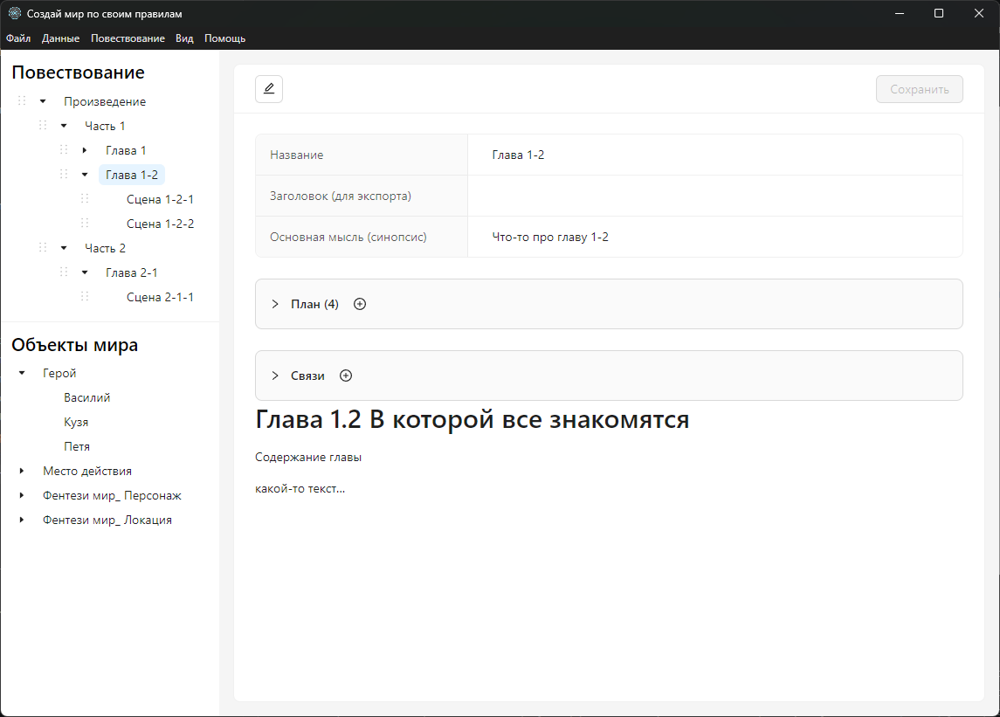

* **Панель "Повествование" (слева сверху):** Отображает иерархическую структуру вашей истории, разбитую на части, главы, сцены и другие элементы.
* **Панель "Объекты мира" (слева снизу):** Представляет собой дерево всех сущностей вашего мира — персонажей, локаций, предметов, организаций и т.д., сгруппированных по их типам.
* **Центральная панель:** Эта панель динамически изменяется в зависимости от выбранного элемента в одной из левых панелей. Здесь вы можете просматривать и редактировать контент (`.md` файлы) и метаданные выбранного объекта или элемента повествования.

## 4. Работа с повествованием

Панель "Повествование" позволяет вам структурировать вашу историю. Вы можете создавать иерархию элементов, таких как Части, Главы и Сцены.

### Создание структуры

1. **Создание нового элемента:**
    * Щелкните правой кнопкой мыши по любому элементу в дереве повествования (или по корневому элементу "Произведение").
    * В появившемся контекстном меню выберите опцию для создания нового дочернего элемента (например, "Создать Часть", "Создать Главу").
    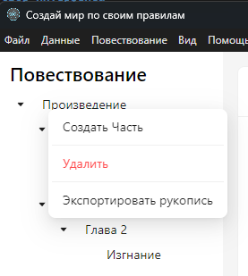
    * Появится модальное окно, где вам нужно будет ввести название нового элемента.
    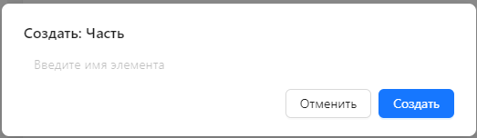
2. **Переименование и удаление:** Аналогично, через контекстное меню вы можете переименовать или удалить существующий элемент.

### Планирование сцены

Для каждого элемента повествования (главы, сцены и т.д.) в центральной панели доступны специальные поля для планирования:

* **Основная мысль:** Краткое описание или ключевая идея данного элемента.
* **План:** Интерактивный чек-лист, в котором вы можете пошагово расписать действия, события или ключевые моменты данного элемента. Отметьте выполненные пункты, чтобы отслеживать прогресс.
    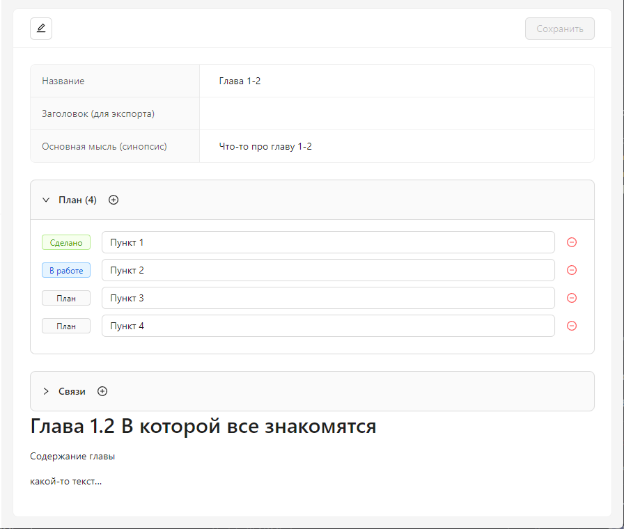

### Написание текста

Основной текст для каждого элемента повествования хранится в отдельном Markdown-файле.

1. Выберите элемент в панели "Повествование".
2. В центральной панели отобразится его контент.
3. Чтобы редактировать текст в вашем любимом редакторе, нажмите кнопку "Открыть в редакторе". Приложение автоматически отслеживает изменения в файле, и вы всегда будете видеть актуальный текст.

## 5. Построение мира

Панель "Объекты мира" — это мощный инструмент для создания и управления всеми сущностями вашего мира. Особенность WriterWorldBuilder в том, что вы сами определяете структуру для каждого типа объектов.

### Шаг 1: Создание Типов (Шаблонов)

Прежде чем создавать конкретные объекты (например, "Артём" или "Город N"), вам нужно определить их "Тип" или "Шаблон" (например, "Персонаж" или "Локация"). Вы также можете создавать свои уникальные типы, такие как "Раса", "Магический артефакт" или "Организация".

1. В верхнем меню выберите `Данные -> Управление типами...`.
2. Откроется модальное окно "Менеджер типов объектов". Здесь вы увидите список всех доступных типов.
    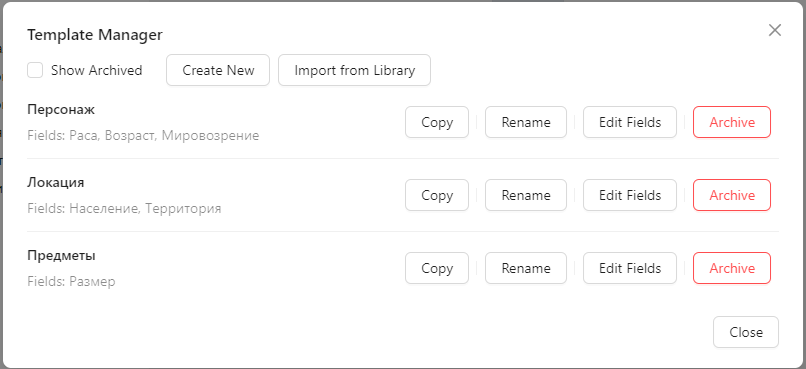
3. Нажмите кнопку "Создать тип", чтобы добавить новый.

### Шаг 2: Конструктор полей

Для каждого типа вы можете определить набор пользовательских полей, которые помогут вам систематизировать информацию.

1. В "Менеджере типов объектов" выберите нужный тип и нажмите кнопку "Редактировать поля" (или "Добавить поля" для нового типа).
2. Откроется модальное окно "Редактор полей типа". Здесь вы можете добавлять новые текстовые поля. Для каждого поля укажите:
    * **Название поля:** Например, "Возраст", "Рост", "Цвет волос".
    * **Комментарий (подсказка):** Краткое описание поля, которое будет отображаться в интерфейсе рядом с полем, помогая вам помнить, какую информацию туда вводить.
    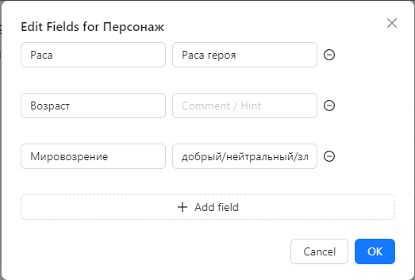
3. После сохранения изменений все объекты данного типа будут иметь эти поля.

### Шаг 3: Создание Объектов мира

После того как вы определили нужные типы, можно создавать конкретные объекты.

1. В панели "Объекты мира" щелкните правой кнопкой мыши по нужному типу (например, "Персонажи").
2. В контекстном меню выберите "Создать объект".
    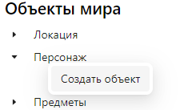
3. Появится модальное окно, где вам нужно будет ввести название объекта.
    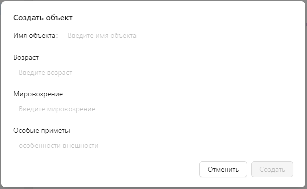

### Шаг 4: Заполнение данных

1. Выберите созданный объект в панели "Объекты мира".
2. В центральной панели вы увидите все поля, которые вы определили для этого типа, а также область для основного Markdown-описания.
3. Заполните поля и при необходимости напишите подробное описание объекта во внешнем редакторе.
    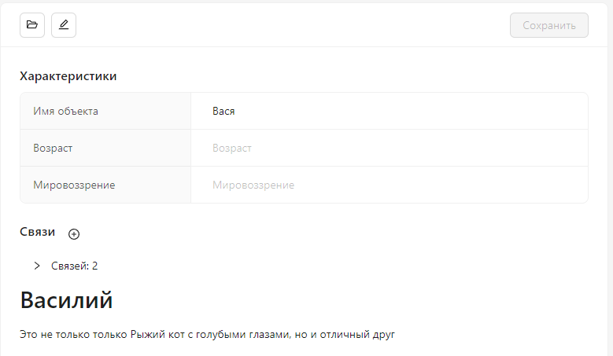

## 6. Установка связей

WriterWorldBuilder позволяет создавать связи между любыми элементами вашего мира (объектами мира или элементами повествования). Это помогает отслеживать отношения, иерархии и взаимодействия.

1. Выберите любой элемент (объект мира или элемент повествования) в одной из левых панелей.
2. В центральной панели, в заголовке, найдите и нажмите кнопку "Добавить связь".
    
3. Откроется модальное окно "Добавить связь".
    * В поле "Найти" начните вводить название элемента, с которым вы хотите установить связь. Приложение будет предлагать варианты по мере ввода.
    * В поле "Описание связи" укажите, как именно связан этот элемент с текущим (например, "враг", "место действия", "создатель").
    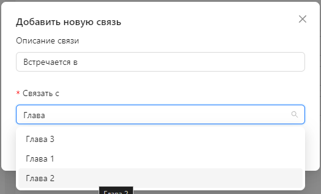
4. Нажмите "Сохранить".

Все связи для текущего элемента будут отображены в списке в нижней части центральной панели. Здесь вы можете просмотреть их или удалить.
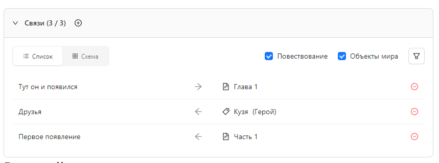

## 7. Экспорт рукописи

Когда ваша история будет готова или вы захотите просмотреть ее целиком, вы можете экспортировать все повествование в единый Markdown-файл.

1. В верхнем меню выберите `Файл -> Экспорт -> Собрать рукопись`.
2. Приложение соберет все Части, Главы и Сцены в правильном порядке и сохранит их в один `.md` файл, который вы сможете открыть в любом текстовом редакторе.
    *Примечание: В данный момент нет визуального индикатора прогресса экспорта, дождитесь завершения операции.*
