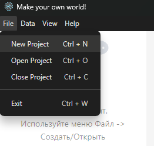
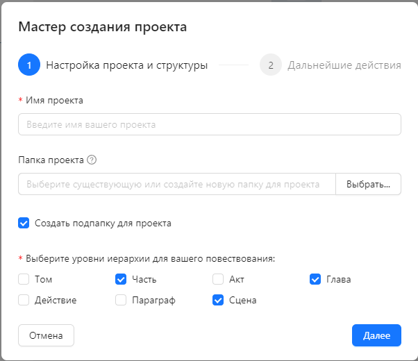
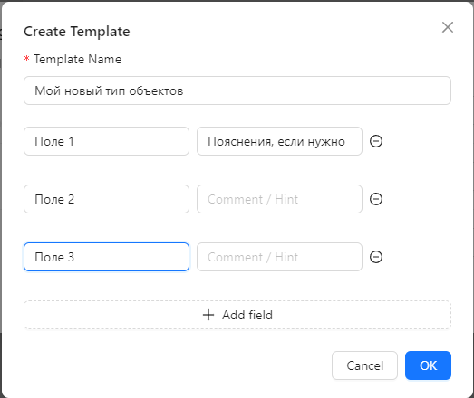
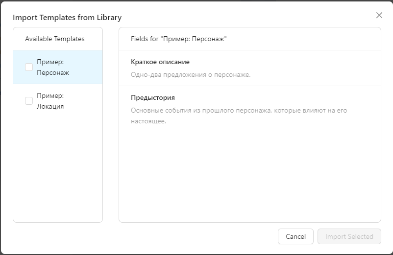

# Руководство пользователя WriterWorldBuilder

*Данное руководство находится в разработке.*

[Вернуться на главную страницу проекта](../README.md)

## 1. Введение

WriterWorldBuilder — это настольное приложение, разработанное специально для писателей, чтобы помочь им создавать, организовывать и управлять вымышленными мирами и повествованиями своих историй. Приложение позволяет строить сложные взаимосвязи между персонажами, локациями, предметами и событиями, обеспечивая целостность и логичность вашего мира.

**Основные возможности:**

* **Управление проектами:** Создавайте, открывайте и легко управляйте своими литературными проектами.
* **Иерархия повествования:** Структурируйте вашу историю, разбивая ее на части, главы и сцены  и т.д.
* **Построение мира:** Создавайте детальные описания объектов вашего мира (персонажей, локаций, предметов) с использованием настраиваемых шаблонов и полей.
* **Гибкое редактирование:** Используйте ваш любимый внешний Markdown-редактор для написания объемных текстов, при этом все изменения будут мгновенно отображаться в приложении.
* **Система связей:** Устанавливайте и визуализируйте связи между любыми элементами вашего мира, чтобы отслеживать отношения и взаимодействия.
* **Экспорт рукописи:** Собирайте все части вашего повествования в единый Markdown-файл для дальнейшей работы или публикации.

## 2. Начало работы

### Создание нового проекта

Чтобы начать работу в WriterWorldBuilder, вам необходимо создать новый проект. Проект — это отдельная папка на вашем компьютере, содержащая всю информацию о вашем мире и истории.

1. Запустите WriterWorldBuilder.
2. В верхнем меню выберите `Файл -> Новый проект` (Ctrl+N).

   
3. Откроется **"Мастер создания проекта"**, который поможет вам настроить базовую структуру

   

   **Шаг 1: Настройка проекта и структуры**
    * **Имя проекта:** Введите название вашего произведения или мира. Это имя также будет использоваться для создания файла проекта.
    * **Расположение:** Нажмите "Выбрать..." и укажите папку, *внутри которой* будет создан ваш проект (например, `C:\Мои документы\Книги`).
    * **Создать подпапку для проекта:** Отметьте этот чекбокс, если вы хотите, чтобы проект был создан в новой подпапке с именем проекта внутри выбранной папки. Если чекбокс не отмечен, файлы проекта будут размещены непосредственно в выбранной папке.
    * **Структура повествования:** Отметьте галочками те уровни иерархии, которые вы хотите использовать в своей истории. По умолчанию выбраны `Часть`, `Глава`, `Сцена`, но вы можете выбрать любую комбинацию, например `Том -> Часть -> Глава`.

4. Нажмите "Далее".

   **Шаг 2: Дальнейшие действия**
    * На этом шаге мастер просто информирует вас о том, что после создания проекта вы сможете в любой момент дополнить его готовыми шаблонами для объектов мира (персонажей, локаций и т.д.) через "Менеджер шаблонов".

5. Нажмите "Создать проект".
6. После этого WriterWorldBuilder создаст файл проекта в указанной Вами папке. Внутри этой папки также будут находиться:
    * Файл `.sqlite`: это база данных проекта (SQLite), содержащая все метаданные.
    * Папки `world` и `narrative`: здесь будут храниться все Markdown-файлы с описаниями.

### Открытие существующего проекта

Если у вас уже есть проект WriterWorldBuilder:

1. В верхнем меню выберите `Файл -> Открыть проект` (Ctrl+O).
2. В открывшемся окне найдите и выберите файл проекта с разрешением .wwb.

## 3. Обзор интерфейса

Основной интерфейс WriterWorldBuilder состоит из трех панелей, которые обеспечивают удобную навигацию и работу с вашим проектом

* **Панель "Повествование" (слева сверху):** Отображает иерархическую структуру вашей истории, разбитую на части, главы, сцены и другие элементы.
* **Панель "Объекты мира" (слева снизу):** Представляет собой дерево всех сущностей вашего мира — персонажей, локаций, предметов, организаций и т.д., сгруппированных по их типам.
* **Центральная панель:** Эта панель динамически изменяется в зависимости от выбранного элемента в одной из левых панелей. Здесь вы можете просматривать и редактировать контент (`.md` файлы) и метаданные выбранного объекта или элемента повествования.

## 4. Работа с повествованием

Панель "Повествование" позволяет вам структурировать вашу историю. Вы можете создавать иерархию элементов, таких как Части, Главы и Сцены.

### Создание структуры

1. **Создание нового элемента:**

    * Щелкните правой кнопкой мыши по любому элементу в дереве повествования (или по корневому элементу "Произведение").
    * В появившемся контекстном меню выберите опцию для создания нового дочернего элемента (например, "Создать Часть", "Создать Главу").

    

    * Появится модальное окно, где вам нужно будет ввести:

        * **Название (для дерева):** Имя для идентификации элемента в дереве повествования.

        * **Заголовок (для экспорта):** Опциональный заголовок, который будет использоваться при экспорте рукописи. Если не указан, файл будет создан без заголовка.

    

2. **Удаление:** Аналогично, через контекстное меню вы можете удалить существующий элемент.
3. **Переименование:** Вы можете переименовать любой объект в центральной панели, отображающей информацию о выбранном объекте. После сохранения, имя объекта обновится и в боковой панели с деоевом объектов.

### Планирование сцены

Для каждого элемента повествования (главы, сцены и т.д.) в центральной панели доступны специальные поля для планирования:

* **Название:** Имя элемента для отображения в дереве.
* **Заголовок (для экспорта):** Опциональный заголовок, который будет использоваться при экспорте рукописи.
* **Основная мысль:** Краткое описание или ключевая идея данного элемента.
* **План:** Интерактивный чек-лист, в котором вы можете пошагово расписать действия, события или ключевые моменты данного элемента. Изменяйте рабочие статусы пунктов, чтобы отслеживать прогресс.

    

### Написание текста

Основной текст для каждого элемента повествования хранится в отдельном Markdown-файле.

1. Выберите элемент в панели "Повествование".
2. В центральной панели отобразится его контент.
3. Чтобы редактировать текст в вашем любимом редакторе, нажмите кнопку "Открыть в редакторе". Приложение автоматически отслеживает изменения в файле, и вы всегда будете видеть актуальный текст.

### Конфигурация внешнего редактора

По умолчанию, WriterWorldBuilder использует стандартное системное приложение для открытия Markdown-файлов. Если вы хотите использовать конкретный внешний редактор, вы можете указать его путь в настройках проекта.

1. В верхнем меню выберите `Файл -> Настройки проекта`.
2. В открывшемся окне перейдите к категории настроек "Редакторы".
3. Найдите поле "Редактор Markdown" и укажите полный путь к исполняемому файлу вашего редактора. Вы можете использовать кнопку "Обзор" для удобного выбора файла.
4. Нажмите "Сохранить изменения".

Теперь, при нажатии кнопки "Открыть в редакторе", WriterWorldBuilder будет запускать указанное вами приложение.

## 5. Построение мира

Панель "Объекты мира" — это мощный инструмент для создания и управления всеми сущностями вашего мира. Особенность WriterWorldBuilder в том, что вы сами определяете структуру для каждого типа объектов.

### Шаг 1: Создание Типов (Шаблонов)

Прежде чем создавать конкретные объекты (например, "Артём" или "Город N"), вам нужно определить их "Тип" или "Шаблон" (например, "Персонаж" или "Локация"). Вы также можете создавать свои уникальные типы, такие как "Раса", "Магический артефакт" или "Организация".

1. В верхнем меню выберите `Данные -> Управление типами...` (Ctrl+Shift+T).
2. Откроется модальное окно "Менеджер типов объектов". Здесь вы увидите список всех добавленных в проект типов
    
3. Нажмите кнопку "Создать", чтобы добавить новый тип объектов
    

### Шаг 2: Импорт готовых шаблонов из библиотеки

Чтобы сэкономить ваше время и предоставить проверенные структуры для стандартных типов объектов, WriterWorldBuilder включает в себя библиотеку готовых шаблонов (например, "Персонаж", "Локация", "Предмет"). Вы можете легко добавить их в свой проект.

1. В "Менеджере типов объектов" нажмите кнопку **"Импорт из библиотеки"**.
2. Откроется окно импорта, разделенное на две части:
    * **Слева** находится список всех доступных для импорта шаблонов. Шаблоны, которые уже существуют в вашем проекте (с таким же именем), не будут показаны в этом списке.
    * **Справа** отображаются поля и их описания для шаблона, выбранного в левом списке. Это позволяет вам ознакомиться со структурой шаблона перед импортом.
3. Выберите шаблон в левом списке, чтобы просмотреть его поля справа.
4. Отметьте галочками те шаблоны, которые вы хотите добавить в свой проект.
5. Нажмите кнопку **"Импортировать выбранные"**. Шаблоны появятся в вашем "Менеджере типов объектов" и будут готовы к использованию.

### Шаг 3: Редактирование типов объектов

Для каждого типа вы можете определить набор пользовательских полей, которые помогут вам систематизировать информацию, а также переименовать типы. Редактировать можно даже импортированные из библиотеки типы (исходные всегда будут доступны для последующего импорта)

1. В "Менеджере типов объектов" нажмите кнопку "Редактировать".
2. Откроется модальное окно "Редактор полей типа". Здесь вы можете добавлять новые текстовые поля. Для каждого поля укажите:
    * **Название поля:** Например, "Возраст", "Рост", "Цвет волос".
    * **Комментарий (подсказка):** Краткое описание поля, которое будет отображаться в интерфейсе рядом с полем, помогая вам помнить, какую информацию туда вводить.

    
3. После сохранения изменений все объекты данного типа будут иметь эти поля.

### Шаг 4: Создание шаблона на основе имеющегося

Вы можете создать копию типа объектов на основе имеющегося в проекте, оставив перввый без изменений.

1. В "Менеджере типов объектов" нажмите кнопку "Дублировать".
2. Откроется модальное окно "Копировать шаблон", аналогичное окну редактированию. В нем вы можете добавить/удалить или отредактировать имеющиеся поля.
3. После сохранения новый шаблон появится в проекте.

### Шаг 5: Создание Объектов мира

После того как вы определили нужные типы, можно создавать конкретные объекты.

1. В панели "Объекты мира" щелкните правой кнопкой мыши по нужному типу (например, "Персонажи").
2. В контекстном меню выберите "Создать объект".

    
3. Появится модальное окно, где вам нужно будет ввести название объекта.

    
4. Дополнительные поля можно заполнить сразу или сделать это позже.

### Шаг 6: Заполнение данных

1. Выберите созданный объект в панели "Объекты мира".
2. В центральной панели вы увидите все поля, которые вы определили для этого типа, а также область для основного Markdown-описания.
3. Заполните поля и при необходимости напишите подробное описание объекта во внешнем редакторе.

    

## 6. Установка связей

WriterWorldBuilder позволяет создавать связи между любыми элементами вашего мира (объектами мира или элементами повествования). Это помогает отслеживать отношения, иерархии и взаимодействия.

1. Выберите любой элемент (объект мира или элемент повествования) в одной из левых панелей.
2. В центральной панели,найдите и нажмите кнопку "Добавить новую связь" ("+").
3. Откроется модальное окно "Добавить связь".
    * В поле "Найти" начните вводить название элемента, с которым вы хотите установить связь. Приложение будет предлагать варианты по мере ввода.
    * В поле "Описание связи" укажите, как именно связан этот элемент с текущим (например, "враг", "место действия", "создатель").

    
4. Нажмите "Сохранить".

Все связи для текущего элемента будут отображены в сворачиваемом списке на центральной панели. Здесь вы можете просмотреть их или удалить.
    

Связей между объектами может быть любое число, в том числе между одними и теми же объектами

## 7. Экспорт рукописи

### 1. Экспорт всей рукописи целиком

Когда ваша история будет готова или вы захотите просмотреть ее целиком, вы можете экспортировать все повествование в единый Markdown-файл.

1. В верхнем меню выберите `Повествование -> Экспортировать всю рукопись`.
2. В диалоговом окне выберите имя файла для экспорта и нажмите "Сохранить".
3. Приложение соберет все Части, Главы и Сцены в порядке, представленном в дереве объектов повествования и сохранит их в один `.md` файл, который вы сможете открыть в любом текстовом редакторе.

### 2. Экспорт части рукописи

Можно экспортировать отдельно любую часть рукописи, например только конкретную главу или часть.

1. В дереве объектов повествования вызовите контекстное меню и выберите пункт "Экспортировать рукопись".
2. В диалоговом окне выберите имя файла для экспорта и нажмите "Сохранить".
3. Приложение соберет все части повествования, входящие в указанную и сохранит их в один `.md` файл.
